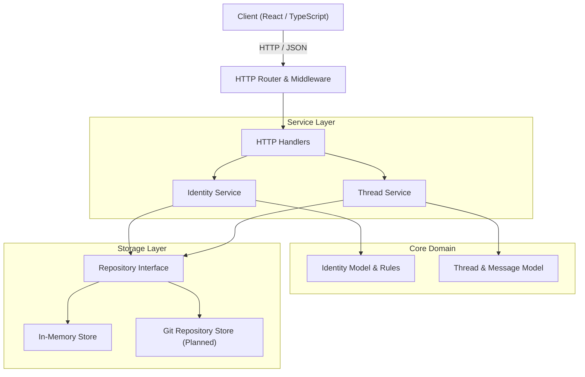

# Chorus

Chorus is an open-source, anonymous discussion platform designed for privacy-preserving, thread-isolated conversations across languages.

## Why Chorus?

Most online communication platforms force users to build permanent online identities, construct follower networks, and compete for engagement metrics. Over time, these incentives prioritize identity over substance, encourage echo chambers, and foster self-censorship.

Additionally, existing global forums often force automatic machine translations that flatten nuance or fragment communities into language silos.

Chorus addresses these challenges by eliminating permanent user accounts and replacing them with thread-isolated identities. Participants engage in discussions without personal profiles or historical reputational bias. Optional on-demand translation allows readers to access content in their preferred language without obscuring original posts.

## Philosophy

Chorus is built around ten core principles:

- **Anonymous by default**: No account registration, email addresses, or credentials required.
- **No usernames**: Identifiers are ephemeral and generated per session or thread.
- **No followers**: Social graphs and follower counts do not exist.
- **No profiles**: Historical posting activity is not aggregated or attached to users.
- **No algorithms**: Content is displayed chronologically without engagement-driven ranking.
- **Discussions over identities**: Conversations focus on message content rather than author identity.
- **Translation is optional**: Content is preserved in its original language, with on-demand translation triggered by the reader.
- **Open source**: Source code, architecture, and deployment models are fully transparent.
- **Privacy first**: Minimal metadata collection with zero persistent personal tracking.
- **Responsible by design**: Built-in mechanisms to report and moderate content while preserving participant anonymity.

## Features

- **Ephemeral Thread Identities**: A unique, temporary identity is generated when participating in a thread. The identity cannot be correlated across different threads.
- **Thread & Message Operations**: Clean HTTP endpoints to create threads, retrieve discussion history, and post messages.
- **Optional Country Flags**: Optional geographic flag display based on coarse IP geolocation.
- **On-Demand Translation**: Readers choose when to translate individual messages, keeping original text primary.
- **Append-Only Git Persistence**: Designed to use Git repositories as an immutable, transparent storage backend.
- **Zero Global State Backend**: Go HTTP service designed around clean layer boundaries, explicit dependency injection, and in-memory or Git-backed persistence.

## Architecture

The diagram below illustrates the relationship between the client, HTTP handlers, domain services, and the persistence engine.



## Project Structure

```text
chorus/
├── cmd/
│   └── server/
│       └── main.go           # Application entrypoint and composition root
├── internal/
│   ├── config/               # Application configuration loading
│   ├── domain/               # Core domain errors and shared models
│   ├── http/                 # HTTP routing, middleware, handlers, and rendering
│   │   ├── handler/          # HTTP request handlers and consumer interfaces
│   │   ├── httputil/         # Request decoding and response writing utilities
│   │   ├── middleware/       # Structured logging and panic recovery
│   │   └── router.go         # Endpoint routing setup
│   ├── idgen/                # Cryptographic ID generator package
│   ├── identity/             # Identity domain logic and service implementation
│   ├── repository/           # Persistence layer implementations
│   │   └── memory/           # Thread-safe in-memory repository
│   └── thread/               # Thread and message domain logic and service
├── go.mod                    # Go module definition
└── README.md
```

## Roadmap

- [x] HTTP server
- [x] Identity system
- [x] Thread service
- [ ] Git repository storage
- [ ] Translation
- [ ] Reports
- [ ] Moderation
- [ ] Realtime updates

## Development

### Prerequisites

- Go 1.22 or higher

### Building

To compile the server binary:

```bash
go build -o server ./cmd/server
```

### Running

To run the server locally:

```bash
go run ./cmd/server
```

By default, the server listens on port `8080`. Configuration can be overridden using environment variables:

```bash
PORT=9090 ENV=production go run ./cmd/server
```

### Testing

Run the full unit and integration test suite with the race detector enabled:

```bash
go test -v -race ./...
```

Run static analysis:

```bash
go vet ./...
```

## Contributing

Contributions are welcome. Please ensure that all pull requests maintain clean architectural layer boundaries, pass unit tests with the race detector enabled (`go test -v -race ./...`), and include appropriate test coverage.

For major architectural changes or new feature proposals, please open an issue first to discuss the proposed design.

## License

Chorus is released under the [MIT License](LICENSE).
